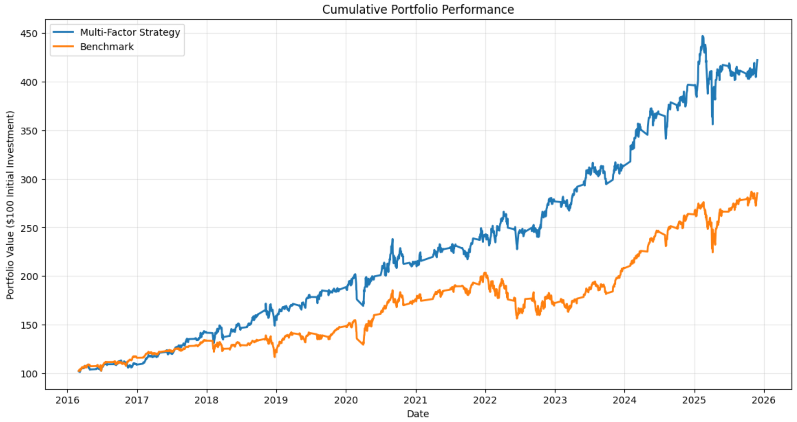
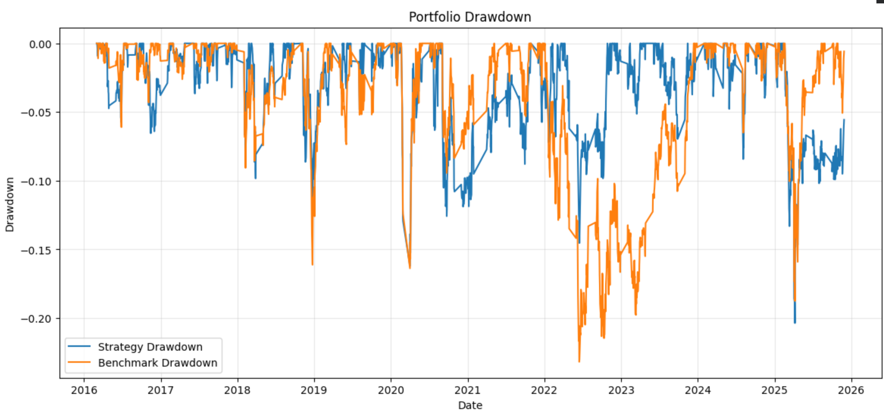
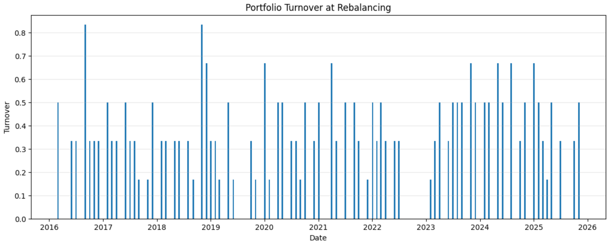

# Quantitative Factor Investing Backtest

A Python-based quantitative equity strategy that combines **momentum** and **low-volatility factors** to systematically select stocks and construct a monthly rebalanced portfolio.

The strategy is backtested against the S&P 500 ETF (`SPY`) using historical market data, transaction cost modelling and standard risk-adjusted performance metrics.

---

## Project Overview

This project implements a Python-based quantitative equity factor investing strategy.

The strategy systematically ranks a universe of large-cap US equities using two quantitative signals:

- **Momentum** — identifies stocks that have demonstrated strong medium-term performance.
- **Low Volatility** — favours stocks with relatively lower realised price volatility.

The factors are ranked cross-sectionally and combined into a composite score.

At each monthly rebalance, the strategy:

1. Calculates factor scores for every stock.
2. Ranks the stocks against each other.
3. Combines the momentum and low-volatility scores.
4. Selects the highest-ranked 20% of securities.
5. Allocates capital equally between the selected stocks.
6. Holds the portfolio until the next rebalance.
7. Repeats the process using updated market information.

A walk-forward backtest evaluates historical performance against the S&P 500 ETF (`SPY`), including estimated transaction costs.

---

## Strategy Workflow

Historical Market Data
        │
        ▼
Data Cleaning and Validation
        │
        ▼
Daily Return Calculation
        │
        ▼
Factor Engineering
 ┌───────────────┐
 │   Momentum    │
 │ Low Volatility│
 └───────────────┘
        │
        ▼
Cross-Sectional Ranking
        │
        ▼
Composite Factor Score
        │
        ▼
Select Top 20% of Securities
        │
        ▼
Equal-Weighted Portfolio
        │
        ▼
Monthly Rebalancing
        │
        ▼
Transaction Cost Adjustment
        │
        ▼
Performance and Risk Analysis

## Project Visualisations

The following visualisations provide insight into the strategy's historical performance, risk characteristics and implementation requirements.

### 1. Cumulative Portfolio Performance

This chart compares the growth of a hypothetical initial investment of $100 in the Multi-Factor Strategy against the S&P 500 benchmark (`SPY`).

The chart helps answer the question:

> Did the factor strategy generate stronger cumulative returns than simply investing in the benchmark?

The strategy equity curve represents the compounded value of daily portfolio returns after applying the monthly portfolio selection and estimated transaction costs.

A higher ending portfolio value indicates stronger historical cumulative performance, although this should always be considered alongside risk metrics such as volatility and maximum drawdown.

---

### 2. Drawdown Analysis

Drawdown measures the percentage decline from a portfolio's previous highest value.

This chart compares the drawdowns experienced by the Multi-Factor Strategy and the S&P 500 benchmark.

The chart helps answer:

> How much could an investor have lost during the strategy's worst historical periods?

A strategy may generate high returns but still experience large losses. Therefore, drawdown analysis provides important information about downside risk.

The maximum drawdown represents the largest peak-to-trough decline during the backtesting period.

---

### 3. Rolling 12-Month Sharpe Ratio

The rolling 12-month Sharpe ratio measures how the strategy's risk-adjusted performance changes over time.

Unlike a single Sharpe ratio calculated over the entire backtesting period, the rolling Sharpe ratio shows whether performance was:

- Consistent.
- Concentrated in particular market periods.
- Sensitive to changing market conditions.

Higher values indicate stronger risk-adjusted returns over the previous 12 months.

Periods below zero indicate that the strategy generated negative risk-adjusted performance during that rolling period.

---

### 4. Portfolio Turnover

Portfolio turnover measures how much the portfolio changes at each monthly rebalance.

Higher turnover indicates that more capital must be traded when the strategy updates its holdings.

This matters because higher turnover can increase:

- Transaction costs.
- Bid-ask spread costs.
- Market impact.
- Implementation complexity.

The chart helps assess whether the strategy's theoretical performance is likely to be practical to implement.

---

## Results and Interpretation

The strategy is evaluated against the S&P 500 ETF (`SPY`) using both return and risk-adjusted performance metrics.

The analysis considers:

- Total return.
- CAGR.
- Annualised volatility.
- Sharpe ratio.
- Maximum drawdown.
- Beta.
- Alpha.
- Portfolio turnover.

The cumulative performance chart shows how the value of a hypothetical investment developed over the backtesting period.

However, cumulative return alone is not sufficient to determine whether a strategy is superior.

For example, a strategy may outperform the benchmark while also experiencing significantly greater volatility or larger drawdowns.

The Sharpe ratio and drawdown analysis therefore provide additional insight into the quality of the strategy's returns.

### How to Interpret the Results

A strong strategy would ideally demonstrate:

- Higher cumulative returns than the benchmark.
- A competitive or higher CAGR.
- Lower or comparable annualised volatility.
- A higher Sharpe ratio.
- A smaller maximum drawdown.
- Reasonable portfolio turnover.

However, no single metric should be interpreted independently.

For example:

> A high return combined with an extremely large drawdown may be less attractive than a slightly lower return with substantially better downside protection.

Similarly:

> A strategy that produces strong gross returns but requires extremely high turnover may perform less well after realistic trading costs.

---

## Key Findings

The project investigates whether combining momentum and low-volatility signals can produce attractive historical risk-adjusted performance.

The strategy attempts to identify securities that demonstrate both:

1. Strong medium-term price performance.
2. Relatively stable recent return behaviour.

The backtest then tests whether systematically selecting these securities and rebalancing the portfolio monthly would have produced attractive historical performance relative to a passive investment in the S&P 500.

The results should be interpreted as **historical research findings rather than predictions of future performance**.

---

# Limitations

## 1. Survivorship Bias

The investment universe consists of a fixed set of large-cap companies that are known to exist today.

Companies that performed poorly, were acquired, went bankrupt or were removed from major indices may not be represented.

This can make historical performance appear stronger than a truly investable point-in-time strategy.

---

## 2. Small Investment Universe

The strategy uses only 30 stocks.

Professional quantitative strategies typically operate across substantially larger investment universes.

A small universe can increase:

- Concentration risk.
- Stock-specific risk.
- Sector bias.

---

## 3. No Sector Neutralisation

The portfolio construction process does not restrict sector exposure.

If several highly ranked stocks belong to the same sector, the portfolio may become heavily concentrated in that industry.

For example, a strong technology market could result in several technology stocks being selected simultaneously.

---

## 4. Simplified Transaction Costs

The strategy assumes a fixed transaction cost of 0.10%.

Real trading costs depend on:

- Liquidity.
- Bid-ask spreads.
- Trading volume.
- Order size.
- Market impact.
- Broker and exchange fees.

Therefore, actual implementation costs may differ from the model.

---

## 5. No Market Impact Model

The backtest assumes trades can be executed without affecting market prices.

In reality, large institutional trades can move the market, particularly in less liquid securities.

---

## 6. Simplified Portfolio Construction

The strategy uses equal weighting.

This means every selected stock receives the same portfolio allocation regardless of:

- Volatility.
- Correlation.
- Liquidity.
- Market capitalisation.

More sophisticated portfolio construction techniques could potentially improve diversification.

---

## 7. Parameter Selection Risk

The strategy uses fixed choices for:

- 252-day momentum lookback.
- 21-day momentum skip period.
- 63-day volatility window.
- 20% stock selection threshold.
- 60/40 factor weighting.

These parameters may influence the results.

Testing many parameter combinations can also introduce **overfitting**, where a strategy is unintentionally designed around historical data rather than genuinely predictive relationships.

---

## 8. Zero Risk-Free Rate Assumption

The Sharpe ratio currently assumes a risk-free rate of zero.

This is a simplification.

A more realistic implementation could use Treasury bill rates from a source such as FRED.

---

## 9. Benchmark Limitations

The strategy is compared against `SPY`, representing the S&P 500.

However, the strategy only invests in a smaller universe of selected large-cap stocks.

This means differences in performance may partially reflect differences in universe construction rather than factor selection alone.

---

## 10. Historical Performance Does Not Guarantee Future Performance

The strategy is based on historical market data.

Relationships between factors and returns can change.

A strategy that performed well historically may underperform in future market conditions.

---

# Potential Improvements

## 1. Point-in-Time Investment Universe

Use historical index constituent data to construct an investment universe that reflects what was actually investable at each point in time.

This would reduce survivorship bias.

---

## 2. Larger Stock Universe

Expand from 30 stocks to:

- S&P 500.
- Russell 1000.
- MSCI World.
- Other liquid equity universes.

This would make the factor analysis more statistically robust.

---

## 3. Additional Factors

Add additional signals such as:

- Value.
- Quality.
- Profitability.
- Earnings growth.
- Free cash flow yield.
- Dividend yield.

This would allow development of a more comprehensive multi-factor model.

